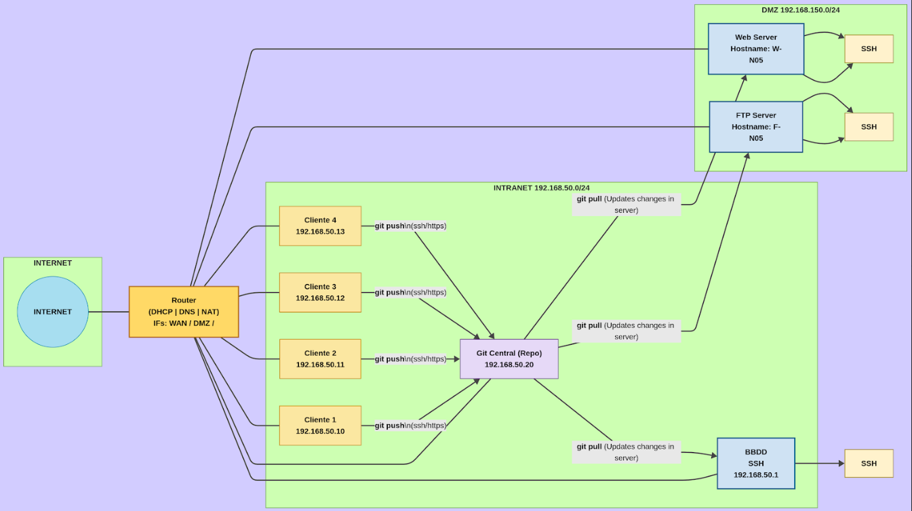

# Activitat Pràctica P0.0  

**Elaborat per:** Adrián González, Sharam Khan, Carlos Rodríguez, Francisco Díaz  
**Data:** Octubre 2025/26  

**Pràctica:**  
Desplegament d’infraestructura

## Índex

1. [Introducció](#introducció)  

## Introducció
En aquesta pràctica es prepara i desplega la infraestructura d’una aplicació multicapa que integra diversos serveis de xarxa i sistemes, com ara servidor web, monitor de xarxa, accés SSH, base de dades, serveis DHCP, DNS i FTP. L’objectiu és dissenyar, configurar i documentar un entorn complet que permeti el funcionament coordinat d’aquests serveis dins d’una arquitectura organitzada en diferents xarxes (DMZ, Intranet i NAT).

El projecte es desenvoluparà durant sis setmanes, dividit en tres sprints quinzenals, i inclourà la planificació de tasques al Proofhub, la configuració dels equips, la creació d’un repositori Git amb tota la documentació i la implementació d’una aplicació que mostri les dades carregades a la base de dades.

## Esquema de les máquinas
Hem decidit distribuir les màquines i els serveis d’aquesta manera, ja que considerem que és l’opció més òptima i senzilla de configurar i gestionar.

