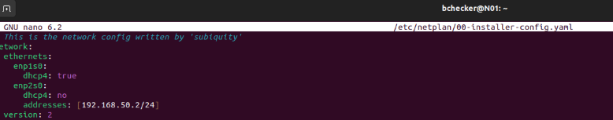

# Activitat Pràctica P0.0  

**Elaborat per:** *Adrián González, (Sharam Khan), Carlos Rodríguez, Francisco Díaz*  
**Data:** Octubre 2025/26  

**Pràctica:**  
Desplegament d’infraestructura


## Índex

1. [Introducció](#introducció)
2. [Esquema de les màquines](#esquema-de-les-màquines)
3. [Màquines Virtuals](#màquines-virtuals)  
    - [Web Server](#web-server)
    - [DHCP i DNS](#dhcp-i-dns)
    - [FTP](#ftp)
    - [BBDD](#bbdd)
    - [SSH](#ssh)
4. [Conclusions](#conclusions)

## <u>Introducció</u>
En aquesta pràctica es prepara i desplega la infraestructura d’una aplicació multicapa que integra diversos serveis de xarxa i sistemes, com ara servidor web, monitor de xarxa, accés SSH, base de dades, serveis DHCP, DNS i FTP. L’objectiu és dissenyar, configurar i documentar un entorn complet que permeti el funcionament coordinat d’aquests serveis dins d’una arquitectura organitzada en diferents xarxes (DMZ, Intranet i NAT).

El projecte es desenvoluparà durant sis setmanes, dividit en tres sprints quinzenals, i inclourà la planificació de tasques al Proofhub, la configuració dels equips, la creació d’un repositori Git amb tota la documentació i la implementació d’una aplicació que mostri les dades carregades a la base de dades.


## <u>Esquema de les màquines</u>
Hem decidit distribuir les màquines i els serveis d’aquesta manera, ja que considerem que és l’opció més òptima i senzilla de configurar i gestionar.


## <u>Estudi de mercat</u>
Abans de començar el projecte, vam decidir fer un estudi previ de les tecnologies que voliem utilitzar. Desrpés d'una intensa recerca, ens vam decantar per aquestes
  - Base de dades (MySQL): Ho marcava a les pautes de l'enunciat
  - Web Server (NGINX): L'any passat vam utilitzar varis motors per webs, i creiem que NGINX és el millor per aquest entorn
  - Router (IpTables): Després d'haver intentat implementar el Proxmox a l'Isard, degut a l'alta complexitat i impossibilitat, vam haver de buscar altres alternatives, i ens vam quedar amb IpTables

## <u>Màquines Virtuals</u>
Al no haver-hi cap software exigit per l'activitat ,hem decidit utilitzar les màquines virtuals del servei al núvol ISARD per la seva simplicitat a l'hora de configurar les seves característiques. D'aquesta manera assegurem que podem connectar les nostres màquinas de forma ràpida i senzilla.

### <u>Web Server</u>
Configurem el nom de l’equip (hostname) i la xarxa (adreça IP).


```bash
sudo echo "W-NOM_SRV" > /etc/hostname

```

Per configurar la xarxa, s'ha de modificar el fitxer /etc/netplan/FITXER_DE_XARXA (habitualment "00-installer-config.yaml)

```bash
network:
  ethernets:
    enp1s0:
      dhcp4: true
    enp2s0:
      dhcp4: true
    enp3s0:
      dhcp4: false
      addresses: [192.168.150.1/24]
version: 2

```


---

Instal·lem Nginx.

```bash
sudo apt install nginx
```

```bash
sudo systemctl status nginx
```
---

Obrim el navegador i comprovem que funciona.


```bash
http://IP_WEB_SERVER
```


---
### <u>ROUTER, DHCP i DNS</u>
#### <u>ROUTER</u>


Canviem el nom de l’equip (hostname).
```bash
sudo echo "ROUTERG05" > /etc/hostname

```
---

Configurem les adreces IP amb Netplan.

```bash
sudo nano /etc/netplan/00-installer-config.yaml
```

```bash
network:
  version: 2
  ethernets:
    enp1s0:
      dhcp4: true
    enp2s0:
      dhcp4: false
      addresses:
        - 192.168.50.1/24
    enp3s0:
      dhcp4: false
      addresses:
        - 192.168.150.1/24
```
---
Configurem la redireccion de paquets

```bash
sudo nano /etc/sysctl.conf 
```
```bash
net.ipv4.ip_forward=1
```
---

Configurem el iptables per la connexió entre xarxes

```bash
sudo nano ./firewall-router-completo.sh
```
```bash
#!/bin/bash

# === DEFINICIÓN DE INTERFACES ===
IF_WAN="enp1s0"   # Internet (192.168.123.x)
IF_LAN="enp2s0"   # Clientes (192.168.50.x)
IF_DMZ="enp3s0"   # Servidores (192.168.150.x)

# === 1. LIMPIEZA (FLUSH) ===
# Borramos cualquier regla anterior para empezar de cero
iptables -F
iptables -X
iptables -t nat -F
iptables -t nat -X
iptables -t mangle -F
iptables -t mangle -X

# === 2. POLÍTICAS POR DEFECTO ===
# Por seguridad: Si no está explícitamente permitido, SE BLOQUEA.
iptables -P INPUT DROP
iptables -P FORWARD DROP
iptables -P OUTPUT ACCEPT

# === 3. REGLAS BÁSICAS ===
# Permitir tráfico de loopback (lo)
iptables -A INPUT -i lo -j ACCEPT
iptables -A OUTPUT -o lo -j ACCEPT

# Permitir conexiones YA ESTABLECIDAS (Stateful Inspection)
# Vital: Si la LAN pide algo a Google, deja entrar la respuesta de Google.
iptables -A INPUT -m state --state ESTABLISHED,RELATED -j ACCEPT
iptables -A FORWARD -m state --state ESTABLISHED,RELATED -j ACCEPT

# Permitir Ping (ICMP) para diagnóstico (Opcional, recomendado)
iptables -A INPUT -p icmp -j ACCEPT
iptables -A FORWARD -p icmp -j ACCEPT

# === 4. REGLAS DE REENVÍO (FORWARD) ===

# A. LAN (enp2s0) -> INTERNET (enp1s0): PERMITIR
iptables -A FORWARD -i $IF_LAN -o $IF_WAN -j ACCEPT

# B. LAN (enp2s0) -> DMZ (enp3s0): PERMITIR
# Para que tú puedas administrar los servidores desde la red de clientes.
iptables -A FORWARD -i $IF_LAN -o $IF_DMZ -j ACCEPT

# C. DMZ (enp3s0) -> INTERNET (enp1s0): PERMITIR
# Para que los servidores puedan actualizarse (apt update, etc).
iptables -A FORWARD -i $IF_DMZ -o $IF_WAN -j ACCEPT

# D. DMZ -> LAN: BLOQUEADO (Por política por defecto DROP)
# Si hackean un server en la DMZ, NO podrán acceder a tus clientes en la LAN.

# === 5. NAT (ENMASCARAMIENTO) ===
# Esto permite que LAN y DMZ salgan a internet usando la IP de enp1s0
iptables -t nat -A POSTROUTING -o $IF_WAN -j MASQUERADE

echo "Reglas de firewall aplicadas correctamente."
```
---

#### <u>DHCP</u>

El objetivo es que cada red reciba **su gateway correcto**, para que BD y Web puedan comunicarse entre ellas a través del router.

Archivos de configuración del dhcp:

```bash
sudo nano /etc/dhcp/dhcpd.conf
```

```bash
# /etc/dhcp/dhcpd.conf
#
# Configuración DHCP para ROUTERG05
#

authoritative;
default-lease-time 600;
max-lease-time 7200;
log-facility local7;

# DNS globales
option domain-name-servers 8.8.8.8, 8.8.4.4;

####################################
#   RED LAN 192.168.50.0/24
####################################
subnet 192.168.50.0 netmask 255.255.255.0 {
  range 192.168.50.100 192.168.50.200;
  option routers 192.168.50.1;
  option subnet-mask 255.255.255.0;
  option broadcast-address 192.168.50.255;
  option domain-name "lan.local";
}

# --- Reservas (LAN) ---
# Servidor BD (base de datos)
host servidor-bd {
  hardware ethernet 52:54:00:1b:62:8f; 
  fixed-address 192.168.150.30;
}

####################################
#   RED DMZ 192.168.150.0/24
####################################
subnet 192.168.150.0 netmask 255.255.255.0 {
  range 192.168.150.100 192.168.150.200;
  option routers 192.168.150.1;
  option subnet-mask 255.255.255.0;
  option broadcast-address 192.168.150.255;
  option domain-name "dmz.local";
}

# --- Reservas (DMZ) ---
# Servidor Web
host servidor-web {
  hardware ethernet 52:54:00:3d:19:f2; 
  fixed-address 192.168.150.40;
}

# Servidor FTP
host servidor-ftp {
  hardware ethernet 52:54:00:6c:be:6a; 
  fixed-address 192.168.150.2;
}

```

```bash
sudo systemctl restart isc-dhcp-server
```

---

## <u>COMPROBACIONES</u>

### 1. BD → Router

```bash
ping 192.168.50.1
```

### 2. BD → Web

```bash
ping 192.168.150.30
```

### 3. Web → BD

```bash
ping 192.168.50.30
```

### 4. SSH desde Web hacia BD

```bash
ssh usuario@192.168.50.30
```

---
#### <u>DNS</u>

---
### <u>FTP</u>

---

Canviem el nom de l’equip (hostname).

```bash
sudo echo "F-NCC" > /etc/hostname

```

---

Configurem les adreces IP amb Netplan.

```bash
sudo nano /etc/netplan/00-installer-config.yaml
```

```bash

network:
  ethernets:
    enp1s0:
      dhcp4: true
    enp2s0:
      dhcp4: false
      addresses: [192.168.150.2/24]
    enp3s0:
      dhcp4: false
      addresses: [192.168.150.2/24]
version: 2
```

```bash
sudo netplan try
sudo netplan apply
```
---

Instal·lem el servidor FTP.

```bash
sudo apt install vsftpd -y
```

---

Configuració FTP (/etc/vsftpd.conf)

```bash
sudo nano /etc/vsftpd.conf
```

```bash
listen=YES
chroot_local_user=YES
allow_writeable_chroot=YES
pasv_min_port=40000
passv_address=192.168.150.2
listen_ipv6=NO
anonymous_enable=NO
local_enable=YES
write_enable=YES
```

---

Recarreguem i activem el servei.

```bash
sudo systemctl restart vsftpd
```
```bash
sudo systemctl enable nginx
```

---

Creem la carpeta destinada al servidor FTP.

```bash
sudo mkdir -p ftp/files
```

---

Assignem els permisos corresponents.

```bash
sudo chown root:root /home/USER/ftp
```
```bash
sudo chown -R root:root /home/USER/ftp
```
```bash
sudo chmod 755 /home/USER/ftp
```

---

Comprovem el funcionament del servidor FTP.

```bash
sftp IP_SERVER_FTP
```


---

### <u>BBDD</u>

Configuració de xarxa


Per configurar la xarxa, s'ha de modificar el fitxer /etc/netplan/FITXER_DE_XARXA (habitualment "00-installer-config.yaml).

```bash
network:
  version: 2
  renderer: NetworkManager
  ethernets:
    enp1s0:
      dhcp4: true
    enp2s0:
      dhcp4: no
      addresses: [192.168.50.250/24] (Ip Client)
    enp3s0:
      dhcp4: no
      addresses: [192.168.150.250/24] (Ip DMZ)
```

---

Creem l’usuari bchecker i li assignem els privilegis corresponents

```bash
sudo adduser bchecker (Creació de l’usuari)
sudo passwd bchecker (Configuració de la contrasenya) 
sudo usermod -aG sudo bchecker (Adició al grup sudo per tenir privilegis)
groups
```

---

Canviem el nom de l’equip (hostname)

```bash
sudo nano /etc/hostname
```

---

Instal·lem MySQL

```bash
sudo apt install mysql-server -y
```

```bash
sudo systemctl status mysql
```

---

Creem l’usuari bchecker amb els privilegis corresponents.

```bash
CREATE USER 'bchecker'@'localhost' IDENTIFIED BY 'bchecker123'; (Usuari + contrasenya)

GRANT ALL PRIVILEGES ON *.* TO 'bchecker'@'localhost' WITH GRANT OPTION; (Cessió de permissos)

FLUSH PRIVILEGES;

EXIT;

```

---

Creació de la taula, i dels seus atributs:

```bash
show tables
```



```bash
desc NOM_TAULA
```


```bash
mysql> LOAD DATA INFILE '/var/lib/mysql-files/escuelas_barna.csv' 
    -> INTO TABLE escuelas_barna_plana 
    -> CHARACTER SET utf8mb4 
    -> FIELDS TERMINATED BY ',' 
    -> ENCLOSED BY '"' 
    -> LINES TERMINATED BY '\n' 
    -> IGNORE 1 ROWS;
ERROR 1300 (HY000): Invalid utf8mb4 character string: ''
mysql> 

```
---

Hem decidit injectar la informació a través d’un LOAD TABLE del .csv, ja que ho vam considerar molt més pràctic que introduir les columnes una per una:

```bash
LOAD DATA INFILE '/var/lib/mysql-files/escuelas_barna_utf8.csv'
INTO TABLE escuelas_barna_plana
CHARACTER SET utf8mb4
FIELDS TERMINATED BY ',' 
ENCLOSED BY '"' 
LINES TERMINATED BY '\n'
IGNORE 1 ROWS
(
    -- Identificadors principals
    @temp_register_id,
    name,
    @temp_institution_id,
    institution_name,

    -- Dates de creació i modificació
    created,
    modified,

    -- Adreça
    addresses_roadtype_id,
    addresses_roadtype_name,
    @temp_addresses_road_id,
    addresses_road_name,
    addresses_start_street_number,
    addresses_end_street_number,
    addresses_neighborhood_id,
    addresses_neighborhood_name,
    addresses_district_id,
    addresses_district_name,
    addresses_zip_code,
    addresses_town,
    @temp_addresses_main_address,
    addresses_type,

    -- Valors i atributs
    @temp_values_id,
    @temp_values_attribute_id,
    values_category,
    values_attribute_name,
    values_value,
    @temp_values_outstanding,
    values_description,

    -- Filtres secundaris
    @temp_secondary_filters_id,
    secondary_filters_name,
    secondary_filters_fullpath,
    secondary_filters_tree,
    @temp_secondary_filters_asia_id,

    -- Coordenades geogràfiques
    @temp_geo_epgs_25831_x,  
    @temp_geo_epgs_25831_y,  
    @temp_geo_epgs_4326_lat, 
    @temp_geo_epgs_4326_lon, 

    -- Dates i horaris
    estimated_dates,
    @temp_start_date,
    @temp_end_date,
    timetable
)

SET 
    -- Identificadors processats
    register_id                = SUBSTRING(@temp_register_id, 2) + 0,
    institution_id             = NULLIF(@temp_institution_id, ''),
    values_id                  = NULLIF(@temp_values_id, ''),
    secondary_filters_id       = NULLIF(@temp_secondary_filters_id, ''),
    secondary_filters_asia_id  = NULLIF(@temp_secondary_filters_asia_id, ''),
    values_attribute_id        = NULLIF(@temp_values_attribute_id, ''),
    addresses_road_id          = NULLIF(@temp_addresses_road_id, ''),

    -- Valors booleans
    addresses_main_address     = IF(@temp_addresses_main_address = 'True', 1, 0),
    values_outstanding         = IF(@temp_values_outstanding = 'True', 1, 0),

    -- Dates
    start_date                 = NULLIF(@temp_start_date, ''),
    end_date                   = NULLIF(@temp_end_date, ''),

    -- Coordenades
    geo_epgs_25831_x           = NULLIF(@temp_geo_epgs_25831_x, ''),  
    geo_epgs_25831_y           = NULLIF(@temp_geo_epgs_25831_y, ''), 
    geo_epgs_4326_lat          = NULLIF(@temp_geo_epgs_4326_lat, ''), 
    geo_epgs_4326_lon          = NULLIF(@temp_geo_epgs_4326_lon, '');
```

---

Durant el procés, vam patir diversos errors de codificació del CSV, per tant, vam haver de passar l’arxiu a utf-8 per evitar problemes.

Una vegada hem fet les correccions, comprovem que les dades s’han inserit de forma correcta:

```bash
SELECT COUNT(*) FROM NOM_TAULA
```


---


### <u>SSH</u>

## <u>Conclusions</u>
