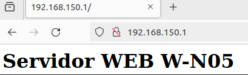

# Activitat Pràctica P0.0  

**Elaborat per:** Adrián González, Sharam Khan, Carlos Rodríguez, Francisco Díaz  
**Data:** Octubre 2025/26  

**Pràctica:**  
Desplegament d’infraestructura


## Índex

1. [Introducció](#introducció)
2. [Esquema de les màquines](#esquema-de-les-màquines)
3. [Màquines Virtuals](@maquines-virtuals)  
    - [Web Server](#web-server)
    - [DHCP i DNS](#dhcp-i-dns)
    - [FTP](#ftp)
    - [BBDD](#bbdd)
    - [SSH](#ssh)
4. [Conclusions](#conclusions)

## Introducció
En aquesta pràctica es prepara i desplega la infraestructura d’una aplicació multicapa que integra diversos serveis de xarxa i sistemes, com ara servidor web, monitor de xarxa, accés SSH, base de dades, serveis DHCP, DNS i FTP. L’objectiu és dissenyar, configurar i documentar un entorn complet que permeti el funcionament coordinat d’aquests serveis dins d’una arquitectura organitzada en diferents xarxes (DMZ, Intranet i NAT).

El projecte es desenvoluparà durant sis setmanes, dividit en tres sprints quinzenals, i inclourà la planificació de tasques al Proofhub, la configuració dels equips, la creació d’un repositori Git amb tota la documentació i la implementació d’una aplicació que mostri les dades carregades a la base de dades.


## Esquema de les màquines
Hem decidit distribuir les màquines i els serveis d’aquesta manera, ja que considerem que és l’opció més òptima i senzilla de configurar i gestionar.


## Màquines Virtuals

### Web Server
Configurem el nom de l’equip (hostname) i la xarxa (adreça IP).


---

Instal·lem Nginx.

```bash
sudo apt install nginx
```

```bash
sudo systemctl status nginx
```


---

Obrim el navegador i comprovem que funciona.


```bash
http://IP_WEB_SERVER
```


-
### DHCP i DNS


### FTP
Creem un usuari i li assignem els permisos corresponents.


---

Canviem el nom de l’equip (hostname).


---

Configurem les adreces IP amb Netplan.


---

Instal·lem el servidor FTP.

```bash
sudo apt install vsftpd -y
```


---

Configuració FTP (/etc/vsftpd.conf)

```bash
sudo nano /etc/vsftpd.conf
```


---

Recarreguem i activem el servei.

```bash
sudo systemctl restart vsftpd
```
```bash
sudo systemctl enable nginx
```


---

Creem la carpeta destinada al servidor FTP.

```bash
sudo mkdir -p ftp/files
```


---

Assignem els permisos corresponents.

```bash
sudo chown root:root /home/USER/ftp
```
```bash
sudo chown -R root:root /home/USER/ftp
```
```bash
sudo chmod 755 /home/USER/ftp
```


---

Comprovem el funcionament del servidor FTP.

```bash
sftp IP_SERVER_FTP
```


---

### BBDD

Configuració de xarxa


---

Creem l’usuari bchecker i li assignem els privilegis corresponents


---

Canviem el nom de l’equip (hostname)


---

Instal·lem MySQL

```bash
sudo apt install mysql-server -y
```

```bash
sudo systemctl status mysql
```


---

Creem l’usuari bchecker amb els privilegis corresponents.


---

Creació de la taula, i dels seus atributs:

```bash
show tables
```


```bash
desc NOM_TAULA
```


```bash
mysql> LOAD DATA INFILE '/var/lib/mysql-files/escuelas_barna.csv' 
    -> INTO TABLE escuelas_barna_plana 
    -> CHARACTER SET utf8mb4 
    -> FIELDS TERMINATED BY ',' 
    -> ENCLOSED BY '"' 
    -> LINES TERMINATED BY '\n' 
    -> IGNORE 1 ROWS;
ERROR 1300 (HY000): Invalid utf8mb4 character string: ''
mysql> 

```
---


### SSH

## Conclusions